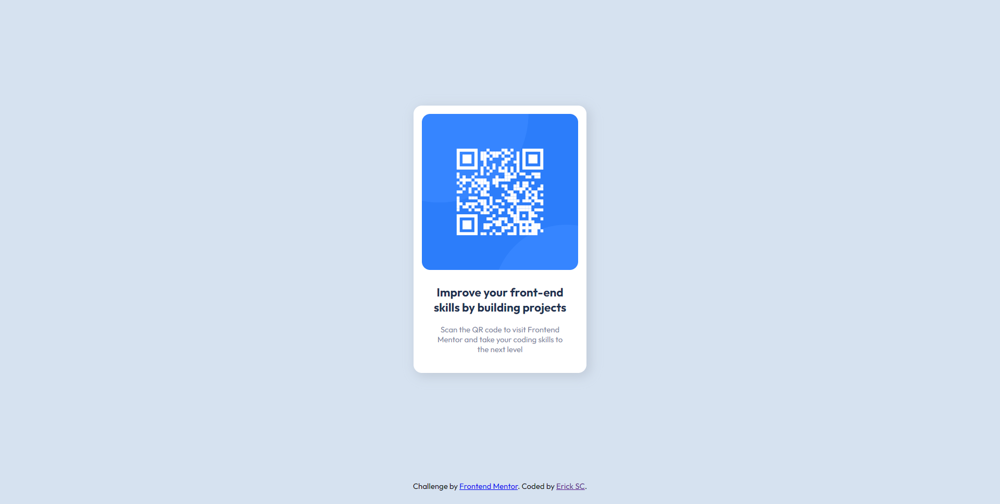

# Frontend Mentor - QR code component solution

This is my solution to the [QR code component challenge on Frontend Mentor](https://www.frontendmentor.io/challenges/qr-code-component-iux_sIO_H). This is my first entry to this site, any suggestions are welcome.

## Table of contents

- [Overview](#overview)
  - [Screenshot](#screenshot)
  - [Links](#links)
- [My process](#my-process)
  - [Built with](#built-with)
  - [What I learned](#what-i-learned)
  - [Continued development](#continued-development)
  - [Useful resources](#useful-resources)
- [Author](#author)

## Overview
### Screenshot

### Links

- Solution URL: https://www.frontendmentor.io/solutions/qr-component-using-flex-ryogeV0Yu-
- Live Site URL: https://ericksc19.github.io/qr-code-component-fm/

## My process
### Built with

- Semantic HTML5 markup
- CSS custom properties
- Flexbox

### What I learned

I started this challenge because I wanted to reinforce previous knowledge and also help me start using Frontend Mentor and Markdown. Also, I learned that using `margin-top: auto;` on an item inside a flex container makes it go automatically to the bottom, regardless of the height (this thanks to an article from Christoph Benjamin Weber), but pushes everything above to the top corner, so adding the same `margin-top: auto;` statement to the component in this case, will keep it more or less in the center.

### Continued development

My aim now is to use this reinforcement to improve my learning of other technologies, right now i'm focusing on react and this will help for sure.

### Useful resources

- [MDN](https://developer.mozilla.org/en-US/) - I consider this the best documentation in this matter out there
- [Christoph's entry](https://wetainment.com/articles/sticky-html-footer/)

## Author

- LinkedIn - [Adolfo Ercik Solís Carrillo](https://www.linkedin.com/in/adolfo-erick-sol%C3%ADs-carrillo-434159226/)
- Frontend Mentor - [@ErickSC19](https://www.frontendmentor.io/profile/ErickSC19)
