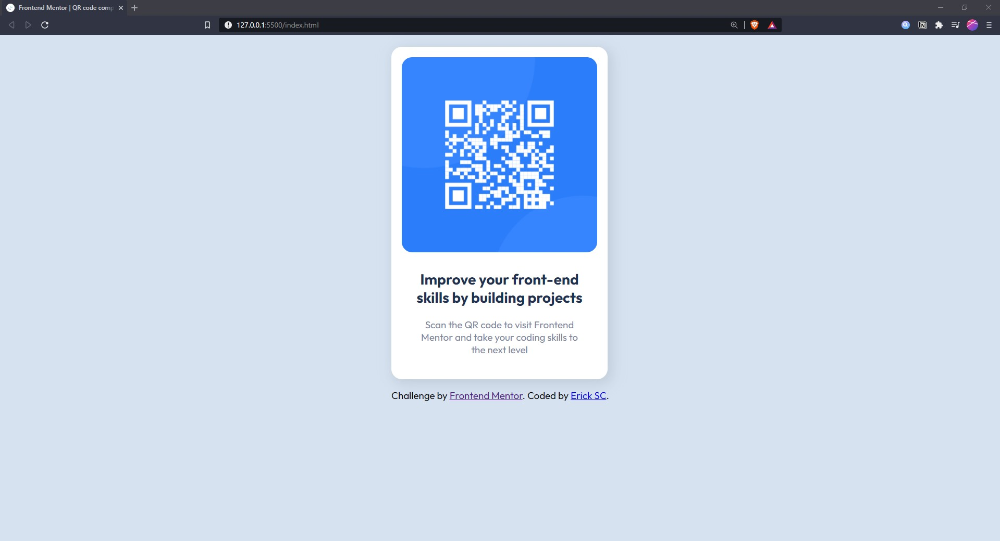

# Frontend Mentor - QR code component solution

This is my solution to the [QR code component challenge on Frontend Mentor](https://www.frontendmentor.io/challenges/qr-code-component-iux_sIO_H). Frontend Mentor challenges help you improve your coding skills by building realistic projects.

## Table of contents

- [Overview](#overview)
  - [Screenshot](#screenshot)
  - [Links](#links)
- [My process](#my-process)
  - [Built with](#built-with)
  - [What I learned](#what-i-learned)
  - [Continued development](#continued-development)
  - [Useful resources](#useful-resources)
- [Author](#author)

## Overview

### Screenshot

### Links

- Solution URL: [Add solution URL here](https://your-solution-url.com)
- Live Site URL: [Add live site URL here](https://your-live-site-url.com)

## My process

### Built with

- Semantic HTML5 markup
- CSS custom properties
- Flexbox

### What I learned

I started this challenge because I wanted to reinforce previous knowledge and also because I could do it in a short time.

### Continued development

My aim now is to use this reinforcement to improve my learning of other technologies, right now i'm focusing on react and this will help for sure.

### Useful resources

- [MDN](https://developer.mozilla.org/en-US/) - I consider this the best documentation in this matter out there

## Author

- LinkedIn - [Adolfo Ercik Solís Carrillo](https://www.linkedin.com/in/adolfo-erick-sol%C3%ADs-carrillo-434159226/)
- Frontend Mentor - [@ErickSC19](https://www.frontendmentor.io/profile/ErickSC19)
